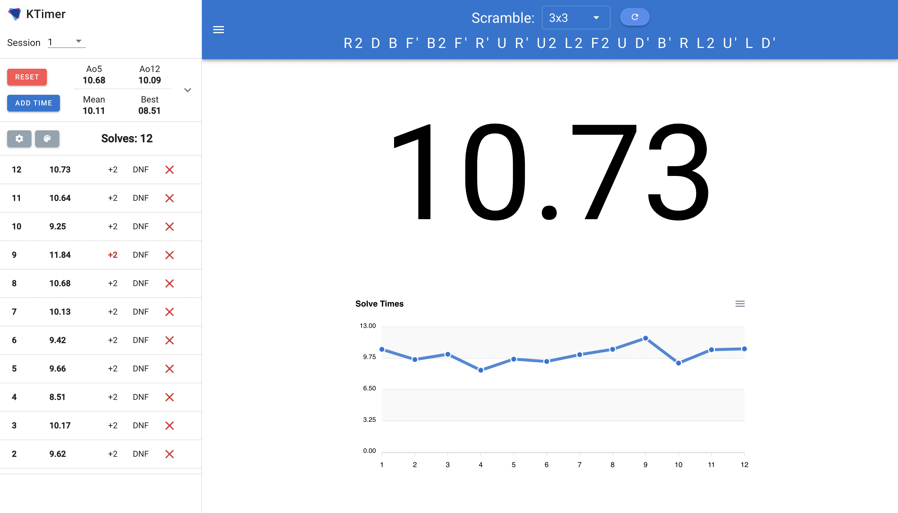

# KTimer

An open source material design speedcubing timer built with [Vue.js](https://vuejs.org/).

Contributions are welcome, please report any issues or requests in the [issues](https://github.com/kt474/KTimer/issues) tab.

|   |
|----------------------------------------------|

## Features

- Mobile/tablet touch screen support
- Customize timer and chart size
- 10 color themes
- Scrambles for 2x2-5x5
- Light/dark mode toggle
- Interactive chart
- Fullscreen mode
- Works offline
- Export times 
- Inspection time
- Solves saved in local storage

## Run Locally

```bash
  git clone https://github.com/kt474/KTimer.git
  cd ktimer
  yarn install
  yarn serve
```

## Acknowledgements

- [Logoipsum](https://logoipsum.com/)
