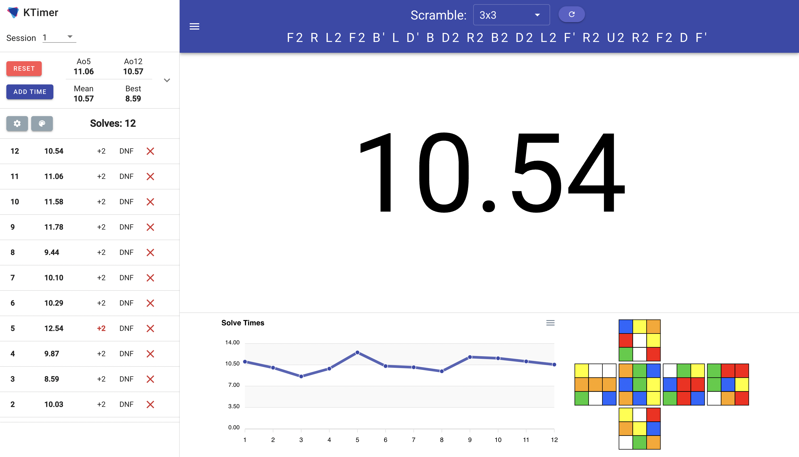

# KTimer

An open source material design speedcubing timer built with [Vue.js](https://vuejs.org/).

Contributions are welcome, please report any issues or requests in the [issues](https://github.com/kt474/KTimer/issues) tab.

|   |
|-----------------------------------------|

## Features 

- Scrambles and displays for all WCA puzzles
- Light/dark mode toggle
- 10 color themes
- Mobile/tablet touch screen support
- Customizable timer and chart size
- Multiple sessions
- Stats from Ao5 to Ao1000
- Interactive chart
- Fullscreen mode
- Export times
- Inspection time

## Run Locally

```bash
  git clone https://github.com/kt474/KTimer.git
  cd ktimer
  npm install
  npm run serve
```

## Acknowledgements

- [Logoipsum](https://logoipsum.com/)
- [Cubing.js](https://github.com/cubing/cubing.js)
